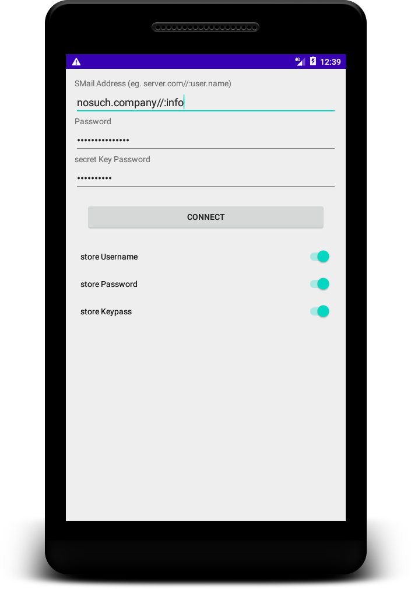

### SMail Client for Android

## The sourcecode for the SMail compatible Client

The SMail client is a piece of software that enable Users to use SMail as a save way to communicate in EMail-Style.
This Software needs a Service that is running a BlackChamber Server like nosuch.company does.

The actual Product is far away from productivity.
But you can Star it to keep your self in loop.

